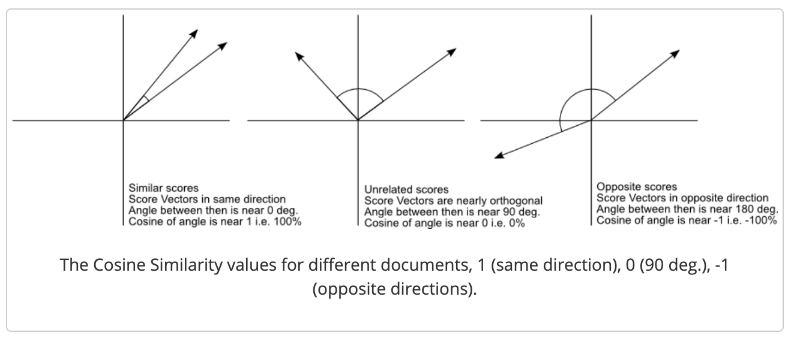

# Capstone Project: Podcast Recommender System

#### Eu Jin Lee [GitHub](https://github.com/missingNA) [LinkedIn](https://www.linkedin.com/in/eeujinlee/)

## Problem Statement

The advent of podcasts started in late 2004 with the public's greater accesibility to broadband Internet and portable digital audio playback devices such as the iPod. This allowed people to explore the digital media space by developing episodic series of spoken word through digital audio files that could be downloaded onto your personal device for easy listening. Discussion and content within a podcast can range from carefully scripted to totally improvised. Podcasts combine elaborate and artistic sound production with thematic concerns ranging from scientific research to slice-of-life journalism.

However in recent years, podcasting has become a disruptive and popular medium to invest in and use as a commercial platform.
As the podcast wars intensifies, major players such as Spotify, Apple's iTunes, Pandora and iHeartRadio are rushing to claim dominance within the media space. And one of the ways that has proven to much success in establishing that dominant position is by developing a reliable and accurate recommendation system for their podcast service platforms.
Our goal is to build a recommendation system based on the podcast descriptors and categories as driving features for our model to create those recommendations.

This recommendation system will then be onboarded onto a front facing website interface that users can interact with by building an app with Flask and hosting our application on Heroku.

## Executive Summary

The workflow of the projects is as follows:
- Importing packages, preliminary data processing, data cleaning & EDA
- Building out components for the Recommender Engine
- Constructing and running a test with the Recommender Engine
- Using Recommender Engine to generate a recommendations database
- Develop the capability to generate predictions with unseen data
- Conclusions and Recommendations

For the purposes of this project, data was sourced from a dataset made available through Kaggle; with over ~121 thousand+ rows of iTunes podcast data from Listen Notes, a podcast search engine. Making it one of the most comprehensive podcast databases that you can find on the Internet. For the project, English podcasts were the primary focus for building the recommendation engine which constitutes about 81.9% (99,316 / 121,175) of the podcasts dataset. However during the process, it is found that the dataset did have a couple discrepancies which will be addressed in the Conclusions and Recommendations. 

The main idea of the recommendation engine is centered around vectorizing the podcast descriptions and binarizing the categories to generate a similarity matrix using scikit-learn Natural Lanaguage Processing (NLP) libraries. The similarity matrix allows us to observe the coefficients of similarity (likeness) of a reference podcast to each one of the other tenths of thousands of podcast. And the results are suprisingly reliable! 

The recommendation system that has been created is a good example of content-based collaborative filtering technique that is commonly used. The recommendation systems used in industry today would likely be a more comprehensive and robust version of this, incorporating hundreds or even thousands of data sources and types.

### Table of Contents 

- [Data Dictionary](#Data-Dictionary)
- [Import Packages](#Import-Packages)
- [Podcast Dataset](#Podcast-Dataset)
    - [Data Import and EDA](#Data-Import-and-EDA)
- [Buiding Recommendation Engine](#Building-Recommendation-Engine)
    - [Constructing categories matrix](#Constructing-categories-matrix)
    - [Generating recommendations](#Generating-recommendations)
        - [TFIDFVectorizer test](#TFIDFVectorizer-test)
        - [CountVectorizer test](#CountVectorizer-test)
        - [Building sparse matrix](#Building-sparse-matrix)
        - [Top 5 Recommendations test](#Top-5-Recommendations-test)
- [Generating Recommendations Database](#Generating-Recommendations-Database)
    - [LookUp function for podcast recommendations](#LookUp-function-for-podcast-recommendations)
- [Generating recommendations on unseen data](#Generating-recommendations-on-unseen-data)
- [Conclusions and Recommendations](#Conclusions-and-Recommendations)
- [References](#References)

### Software Requirements 
- [scikit-learn](https://scikit-learn.org/stable/) (NLP Libraries)
- [sparse](https://docs.scipy.org/doc/scipy/reference/sparse.html) (Handling sparse matrices)

## Dataset
The datataset used for the project can be found [here.](https://www.kaggle.com/listennotes/all-podcast-episodes-published-in-december-2017?select=podcasts.csv)

### Data Dictionary
#### Podcast Data 
| Features    | Type   | Description                              |
|-------------|--------|------------------------------------------|
| uuid        | object | Listen Notes dataset id                  |
| title       | object | title of the podcast                     |
| image       | object | logo of podcast                          |
| description | object | short descriptive text about the podcast |
| language    | object | language of podcast                      |
| categories  | object | associated categories of podcast         |
| website     | object | website url of podcast                   |
| author      | object | authors/contributors of the podcast      |
| itunes_id   | int64  | iTunes podcast id                        |

#### Recommendation Data (generated)
| Features    | Type   | Description                     |
|-------------|--------|---------------------------------|
| ref_podcast | object | referenced podcast              |
| first_rec   | object | top recommended podcast         |
| second_rec  | object | second most recommended podcast |
| third_rec   | object | third most recommended podcast  |
| fourth_rec  | object | fourth most recommended podcast |
| fifth_rec   | object | fifth most recommended podcast  |

## Conclusion and Recommendations

### Initial challenges
As mentioned in the executive summary there were some discrepancies that we found during process of the project. 
1. Some podcasts were incorrectly categorized under the `English` language. 
2. There was one particular podcast that was named `NA` but was mistaken as a nan within the dataset which caused an `Index 0 is out of bounds for axis 0 with size 0` error. (This corrected in the `Generating Recommendations Database` section)
Another challenge that was encountered was the lack of RAM during the computation of the recommendations. What was found was: there needs to be a break between generating the sparse matrix and computing the similarity matrix due to the computer running out of RAM. This in turn causes the kernel to die and prematurely ending the program. It is definitely doable with excess RAM, but for this case I needed to be careful in selecting which functions to run through. This is why you might notice that there are some lines of code which have been commented out. 

Moving forward, a more thorough cleaning process would need to be implemented to filter out and ensure that all existing podcasts are of the `English` language.

In this project, a podcast recommendation system was build based on the idea of content-based collaborative filtering. The content used were from the descriptions and categories of the podcasts. Descriptions were tokenized and vectorized using the Natural Language Processing libraries by scikit-learn to obtain the frequency of key words within each of the podcast descriptions. This is paired with a binarized matrix of the categories of each podcast. These two elements were combined to generate a similarity matrix using a mathematical operations, cosine similarity.

Cosine similarity is a metric used to determine how similar two entities are irrespective of their size. Mathematically, it measures the cosine of the angle between two vectors projected in a multi-dimensional space.

And we can see in the results, that it works pretty well in generating similar podcast recommendations. another valuable lesson that was learnt from this project was learning to scale up a recommendation system and dealing with large amounts of data. A common challenge faced was an issue with overloading RAM which caused the kernel to crash. Hence, experimentations and investigating the form in which the data is being fed through the system had to be carefully observed and unpacked to avoid the issue from arising.  

Once the recommendation engine is completed, a pregenerated database of podcast recommendations is created and stored for quick queries. This a common technique used in Big Data industries. For example, Amazon generates prior shopping recommendations listed as `Frequently bought together` or `Customers who viewed this item also viewed`. This saves computing time and power instead of generating real-time recommendations. Hence, it was a great opportunity to exercise a similar methodology. After that, all it takes is a simple lookup query to find the podcast recommendations. 

Finally, adding a little real world complexity to the construction of the recommender system: unseen data. There will be cases where the data expands beyond what the model has been originally trained on. To account for this, a preliminary data pipeline was created to instantiate new data, requiring users to enter a title, write a description and categorize an unfamiliar podcast and allowing the recommender system to generate a prediction. 

### Expansion
It is widely known in the coding/programming community that our work is a constant iterative process: fixing and improving what has been built. Future directions of the recommender system would be to incorporate more data sources such as the episodes.csv located in the data folder and also learning to intergrate other data types like podcast audio files.

## References
- Building a Podcast Recommendation Engine https://www.kaggle.com/switkowski/building-a-podcast-recommendation-engine
- How to Clean Text for Machine Learning with Python https://machinelearningmastery.com/clean-text-machine-learning-python/
- What is a cosine similarity matrix? https://medium.com/acing-ai/what-is-cosine-similarity-matrix-f0819e674ad1
- A Gentle Introduction to Sparse Matrices for Machine Learning https://machinelearningmastery.com/sparse-matrices-for-machine-learning/
- How do I get indices of N maximum values in a NumPy array? https://stackoverflow.com/questions/6910641/how-do-i-get-indices-of-n-maximum-values-in-a-numpy-array/38884051
- How to create a production-ready Recommender System https://towardsdatascience.com/how-to-create-a-production-ready-recommender-system-3c932752f8ea
- Converting sparse matrix to dense matrix https://docs.scipy.org/doc/scipy/reference/generated/scipy.sparse.csr_matrix.todense.html
- 20 Podcast Predictions for 2020 from Top Industry Leaders https://blog.pacific-content.com/20-podcast-predictions-for-2020-from-top-industry-leaders-f4ef49e48909
- How to transform numpy.matrix or array to scipy sparse matrix https://stackoverflow.com/questions/7922487/how-to-transform-numpy-matrix-or-array-to-scipy-sparse-matrix